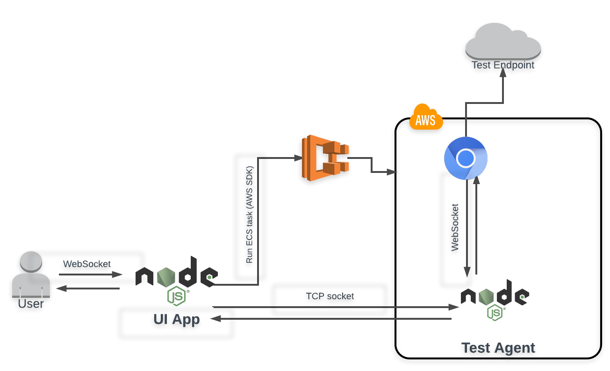

# Architecture

## Application

### Responsibilities

* Providing the UI in which to carry out the tests from.

## Test Agent

A test agent is a short-lived ECS container whose TTL is the duration of the test run. It is based on Alpine Linux with Chromium and XVFB which provides headless processing.

Chromium is started up with a custom Chrome extension running. The extension is responsible for returning the relevant metrics based upon the test run configuration.

### Responsibilities

* Orchestrating the test run configuration passed into it from the UI application
* Establishing a TCP connection back to the UI application to provide a stream in which to provide metrics.
